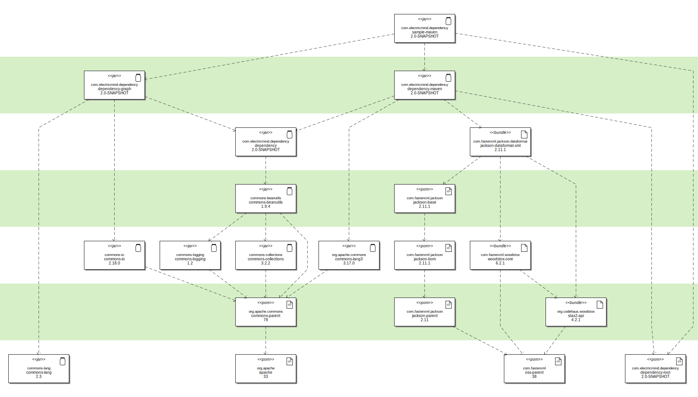

# Sample Maven

This project exists to show how to create a dependency graph of Maven artifacts.
The resulting graph shows the hierarchy of dependencies in the sample-maven codebase.

The graph looks like this:

Some of the features of this graph include:

1. Maven artifact names are shown in the "three part" format (group id, artifact id, and version).
2. Artifact stereotypes show the packaging format of the Maven artifact
3. There are also icons for jars, POMs and standard artifacts.