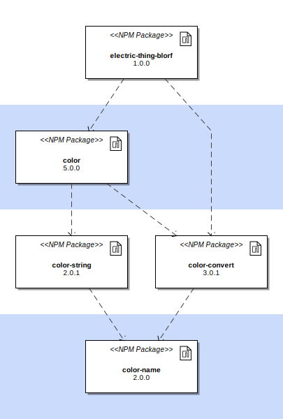

# NPM Dependency Analysis

The purpose of this sample is to demonstrate how dependencies can be analyzed in
NPM-based packages. The `SimpleNpmDependencies` class reads a `package-lock.json` file
that contains a set of resolved NPM dependencies. The class assembles the dependency
graph and outputs the following.

